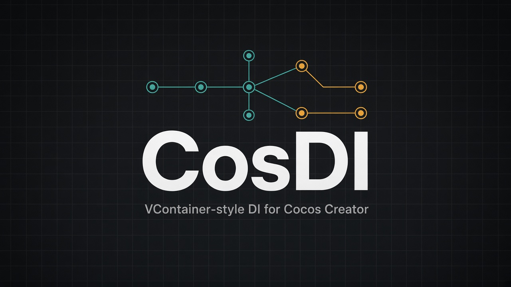
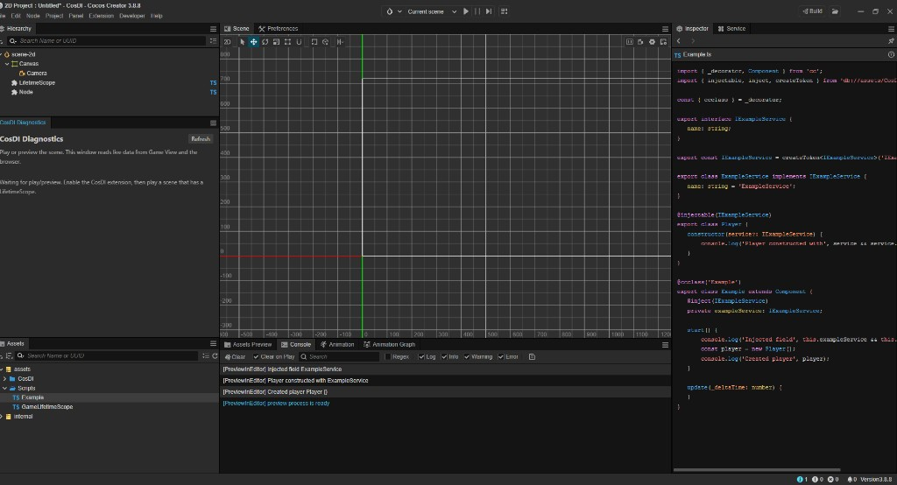
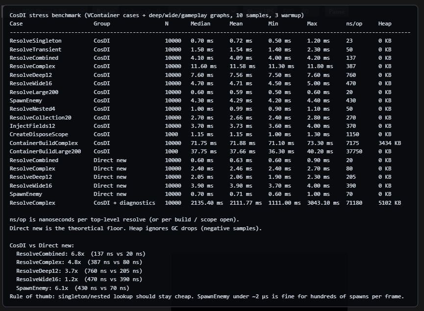

<p align="center">
  
</p>

<h1 align="center">CosDI</h1>

<p align="center">
  <strong>VContainer-style dependency injection for Cocos Creator 3.x</strong>
</p>

<p align="center">
  <a href="https://github.com/vvda12061999/CosDI/stargazers"></a>
  <a href="https://www.npmjs.com/package/cosdi"></a>
  <a href="https://www.npmjs.com/package/cosdi-diagnostics"></a>
  <a href="https://github.com/vvda12061999/CosDI/actions/workflows/ci.yml"></a>
  
  
</p>

<p align="center">
  
</p>

If this saves you time in a Cocos project, please **[⭐ star the repo](https://github.com/vvda12061999/CosDI)**. Stars help other Creator developers find it.

## Contents

1. [Installation](#1-installation)
2. [Quick start](#2-quick-start)
   - [Service](#service)
   - [Interface as a service](#interface-as-a-service)
   - [Inject without naming the key](#inject-without-naming-the-key)
   - [Generator settings](#generator-settings)
   - [Register in a LifetimeScope](#register-in-a-lifetimescope)
   - [What build() checks](#what-build-checks)
   - [The dependency graph](#the-dependency-graph)
   - [Checked before the game runs](#checked-before-the-game-runs)
   - [When a resolve fails anyway](#when-a-resolve-fails-anyway)
   - [Inject a component field](#inject-a-component-field)
   - [`new Player()` fills constructor deps](#new-player-fills-constructor-deps)
3. [Proof of concept](#3-proof-of-concept)
4. [Benchmark](#4-benchmark)
   - [Environment](#environment)
5. [Notes](#5-notes)
6. [How to contribute](#6-how-to-contribute)
7. [Bug reports](#7-bug-reports)
8. [How to support](#8-how-to-support)

---

## 1. Installation

All from npm. Run this in your Cocos Creator project root:

```bash
npm install cosdi cosdi-diagnostics cosdi-codegen
```

| Package | What it is |
| --- | --- |
| [`cosdi`](https://www.npmjs.com/package/cosdi) | The runtime you import from your scripts |
| [`cosdi-diagnostics`](https://www.npmjs.com/package/cosdi-diagnostics) | The **CosDI Diagnostics** editor panel |
| [`cosdi-codegen`](https://www.npmjs.com/package/cosdi-codegen) | Gives a tagged interface a token, so it can be a DI key |

Only `cosdi` is required. Skip `cosdi-codegen` if you never key anything by interface.

Or from GitHub:

```bash
npm install git+https://github.com/vvda12061999/CosDI.git
```

Then:

```ts
import { LifetimeScope, inject, injectable } from 'cosdi';
```

Both extensions copy themselves into your project's `extensions/` folder while npm installs them, so no zip import is needed, and `cosdi-codegen` generates your tokens then and there. Restart Cocos Creator: **Panel → CosDI Diagnostics** and the **CosDI** menu are waiting.

If npm ran somewhere other than the project root, point it at the project yourself:

```bash
npx cosdi-diagnostics install --project /path/to/project
npx cosdi-diagnostics status
npx cosdi-diagnostics uninstall
```

Set `COSDI_DIAGNOSTICS_SKIP_INSTALL=1` to skip the automatic copy, and run `npx cosdi-diagnostics uninstall` before `npm uninstall cosdi-diagnostics` so the copied folder goes away with it.

Prefer a manual import? [`cosdi-diagnostics.zip`](https://github.com/vvda12061999/CosDI/releases/latest/download/cosdi-diagnostics.zip) is still attached to every release and works in **Extension → Extension Manager → Project**.

---

## 2. Quick start

Cocos does **not** compile parameter / constructor `@` decorators. Use field `@inject` on components, and `@injectable(Class)` on plain classes.

### Service

The class is the service. No interface or token required.

```ts
export class ExampleService {
    name = 'ExampleService';
}
```

### Interface as a service

Cocos erases `interface`, so an interface leaves no value behind to use as a DI key, and TypeScript rejects a decorator on one. Tag it in a comment and CosDI generates the token for you — outside `assets/`, so your file keeps nothing but the interface:

```ts
// IPlayerService.ts
/** @generateToken */
export interface IPlayerService {
    attack(): void;
}
```

The token lands in `node_modules/cosdi-tokens`. Import it and the name works in both positions, as a type and as a value:

```ts
import { IPlayerService } from 'cosdi-tokens';

builder.register(PlayerService, Lifetime.Singleton).as(IPlayerService);
```

```ts
@inject(IPlayerService)
private playerService: IPlayerService;
```

`resolve(IPlayerService)` is typed `IPlayerService`, with no cast. Delete the tag and the token goes with it; rename the interface and the token follows on the next save.

Prefer importing from your own path? One re-export gives you that, and it is the only file you write:

```ts
// assets/Scripts/Services.ts
export * from 'cosdi-tokens';
```

```ts
import { IPlayerService } from './Services';
```

`@generateToken('Game.IPlayerService')` sets the token name. Generic interfaces are skipped, because each type argument would need a token of its own. `@createToken` still works as a tag, and calling `createToken('IPlayerService')` by hand still works too: the generator leaves a name that already has a value alone.

### Inject without naming the key

For a field typed as a class, `@inject` on its own is enough:

```ts
@inject
private playerService: PlayerService;
```

Creator compiles no decorator metadata, so there is no declared type to read at runtime. The field name is what CosDI goes on: `playerService` looks for a registration named `PlayerService`, then one named `IPlayerService`, and registering a class or generating a token is what puts those names in reach. (Where a toolchain does emit `design:type`, that wins.)

Two cases want the key spelled out. A field whose name does not match the service it wants has to say so. And a class registers under `Class.name`, which a minifier rewrites, so a class-typed field in a minified build wants `@inject(PlayerService)` — an interface token is a string literal and survives, so `@inject(IPlayerService)` and a bare `@inject` on a matching field name are both safe there.

A string works as a key anywhere a token does, if you would rather not generate anything at all:

```ts
builder.register(PlayerService, Lifetime.Singleton).as('IPlayerService');

@inject('IPlayerService')
private playerService: IPlayerService;
```

That resolves as `object` unless the generator maps it; `mode: "keys"` below writes that map.

### Generator settings

The generator is the **CosDI Codegen** extension. `npm install cosdi-codegen` copies it into `extensions/cosdi-codegen`, generates your tokens on the spot, and needs no configuration. It regenerates when the extension loads, on every `.ts` save, and from **CosDI → Generate Interface Tokens**. Outside the editor:

```bash
npx cosdi-codegen generate           # write
npx cosdi-codegen generate --check   # fail if stale, for CI
```

Every field of an optional `cosdi.codegen.json` in the project root:

```json
{
  "roots": ["assets/Scripts"],
  "exclude": ["Vendor"],
  "mode": "package",
  "packageName": "cosdi-tokens",
  "include": "tagged",
  "generateOnSave": true
}
```

`roots` and `exclude` keep the scan off the rest of the project. A save only revisits the file you saved, so hook cost does not grow with project size; the menu item and the CLI still sweep everything. `generateOnSave: false` turns off the save hook.

`mode` decides what is generated and where:

| Mode | What lands where | Used as |
| --- | --- | --- |
| `package` (default) | A local package outside `assets/`, `node_modules/<packageName>` | `IPlayerService`, from `'cosdi-tokens'` |
| `keys` | One `.d.ts` outside `assets/` typing string keys; no tokens | `'IPlayerService'` |
| `file` | One module at `out`, which must sit under `assets/` | `IPlayerService`, from `./Tokens.generated` |
| `inline` | A `// cosdi:token` line beside each interface | `IPlayerService`, from its own file |

Creator resolves bare specifiers with the Node algorithm, which is how the `cosdi` package itself is imported, so the generated package compiles like any dependency. Two things to know: `npm install` wipes `node_modules`, and the generator rewrites the package on the next save, editor load, or `npx cosdi-codegen generate`. A path alias in `tsconfig.json` is not an alternative, because Creator does not read `tsconfig.json` when it compiles.

`keys` mode is the one that generates no token at all. It writes a single declaration mapping each key to its type, so `resolve('IPlayerService')` is typed while your sources stay untouched, and with `"include": "exported"` it needs no tag either:

```json
{ "mode": "keys", "include": "exported" }
```

Every mode except `inline` exports the interface type and its token under one name and never writes into your sources. In exchange, the file that declares an interface cannot import its own token — TypeScript rejects an import that collides with a local declaration — so keep tagged interfaces in their own files. Switching modes clears whatever the previous mode wrote.

### Register in a LifetimeScope

```ts
import { _decorator } from 'cc';
import { LifetimeScope, IContainerBuilder } from 'cosdi';
import { ExampleService } from './Example';

const { ccclass } = _decorator;

@ccclass('GameLifetimeScope')
export class GameLifetimeScope extends LifetimeScope {
    protected configure(builder: IContainerBuilder): void {
        builder.register(ExampleService);
    }
}
```

Add `GameLifetimeScope` to a node in the scene. `register` is a singleton unless you pass `Lifetime.Scoped` or `Lifetime.Transient`.

### What build() checks

`build()` reads the registrations before anything is resolved and refuses the ones that cannot work, so a mistake surfaces where you wrote it instead of at the first resolve, halfway into a scene:

```
CosDIValidationException: Container validation found 2 problems:
  1. Circular dependency detected: PlayerService -> InventoryService (constructor parameter 'inventory')
     -> PlayerService (field 'player'). Break it by taking IObjectResolver and resolving one side when it
     is needed, or by handing one side over with registerFactory.
  2. IInventoryService is registered as something to construct, but it is a key, not a class. Register the
     class and name it with .as(IInventoryService), or hand over an instance with registerInstance /
     registerFactory.
  Set builder.validateOnBuild = false to build anyway, as a dependency that only a child scope registers needs.
```

Every problem is reported by the same build, not one per run. It looks at what the container itself creates — `registerInstance` and `registerFactory` hand over a finished object, so those are left alone — and it reports four things:

| Reported | Meaning |
| --- | --- |
| Circular dependency detected | Something needs itself, straight away or the long way round |
| asks for X, which nothing registers | A constructor parameter, field or injected method wants something no scope has |
| has no key for `...` | Nothing tells the container what to inject there: no token, and no registration goes by that name |
| registered as something to construct, but it is a key | `register(IPlayerService)` where `register(PlayerService).as(IPlayerService)` was meant |

A dependency is looked for in this container and in the scopes above it, which is where the container looks at resolve time. It cannot see a scope built later, so a service that only a child scope registers reads as missing — that is the case for `builder.validateOnBuild = false`, or `ContainerBuilder.validateByDefault = false` for every builder. `validateRegistrations(registrations, registry)` gives the same list without building, and `CosDIValidationException.problems` carries it, each with a `kind` and, for a loop, the registrations it runs through.

#### Circular dependencies

A loop is checked for whether or not validation is on, because left alone it is a stack overflow at the first resolve rather than anything you can act on. The chain names every step and where each one asks:

```
Circular dependency detected: PlayerService -> InventoryService (constructor parameter 'inventory') -> PlayerService (field 'player')
```

Constructor parameters, `@inject` fields and injected methods all count, since field injection happens while the instance is still being made. What the container does not construct ends the walk, so `registerFactory`, `registerInstance` and a value given with `withParameter` break a loop here exactly as they break one at runtime — which is also how you fix one, alongside taking `IObjectResolver` and resolving the other side at the moment you need it.

Each registration is read once, so a graph where services share dependencies costs what it looks like it should: a 34-deep chain whose services each take the two below them is checked in under a millisecond. Validation adds about 2 µs to a twelve-service build, so leaving all of it on in a shipping build is fine.

### The dependency graph

What validation reads is kept, so you can read it too. `container.dependencyGraph` is the whole container as a graph: one node per registration, one edge per thing it asks for, and what answered.

```ts
import { dependencyGraphText } from 'cosdi';

console.log(dependencyGraphText(container));
```

```
GameEntryPoint [Singleton class]
├─ field 'player' -> Player [Transient class]
│  ├─ constructor parameter 'example' -> ExampleService [Singleton class, as IExampleService]
│  └─ constructor parameter 'inventory' -> InventoryService [Singleton class, as IInventoryService]
│     └─ constructor parameter 'example' -> ExampleService [Singleton class, as IExampleService]
└─ field 'audio' -> IAudioService (nothing registers it)
IObjectResolver [Transient container]
```

It is drawn from the roots — what nothing else asks for, which is usually your entry points — and a node with dependencies of its own is drawn once, then marked. A loop is marked `(cycle)` where it closes and listed underneath, so a container that `build()` refused can still be looked at: `builder.dependencyGraph()` answers before the build does.

`dependencyGraphMermaid(container)` writes the same thing as a Mermaid flowchart, which GitHub and most Markdown viewers draw. Unmet edges come out dashed.

Each node carries its `registration`, `lifetime`, `contracts`, `key`, `source` (`class`, `component`, `instance`, `factory`, `container`, `collection`), `edges` and `dependents`, so you can walk it yourself:

```ts
const graph = container.dependencyGraph;

const player = graph.find(Player);
player.edges.map((edge) => edge.site);          // where it asks
graph.reachableFrom(player);                    // everything it pulls in
graph.roots.filter((node) => node.lifetime === Lifetime.Singleton);
```

Every edge says what answered it: `local` here, `parent` in a scope above, `missing` when nothing registers it, `keyless` when nothing says what to inject. A scope's graph lists what its parents registered as nodes of its own, marked `from a parent scope`, so a child scope reads as what it can actually resolve.

The **CosDI Diagnostics** panel draws the same graph under each scope while the game plays, next to the resolve counts. Keeping the graph costs a few hundred bytes per scope; `builder.keepDependencyGraph = false`, or `ContainerBuilder.keepGraphByDefault = false` for every builder, leaves `container.dependencyGraph` empty without changing what `build()` checks.

### Checked before the game runs

`build()` only runs once play reaches the scene that builds the container, which on a big project can be several menus in. The **CosDI Codegen** extension reads the same mistakes straight out of your sources, so a typo fails the build instead of the level:

```bash
npx cosdi-codegen validate            # 0 when the project is sound, 1 when it is not
npx cosdi-codegen validate --strict   # warnings fail too
```

```
assets/Scripts/Hud.ts:6:5  error  Hud asks for IPlayerServcie (field 'playerService'), which nothing
in this project registers. [missing-registration]
[CosDI Codegen] 5 file(s), 1 registration(s), 1 error(s), 0 warning(s)
```

The same check runs on every `.ts` save and from **CosDI → Validate Dependencies**, printing to the editor console, and again when you press **Build**, where an error stops the build before it packages anything. What it looks for:

| Rule | Reported when |
| --- | --- |
| `missing-registration` | A key an `@inject` or `@injectable` asks for that nothing in the project registers |
| `no-key` | A bare `@inject` or an unnamed constructor parameter whose name matches nothing registered |
| `key-as-class` | `register(IPlayerService)` where `register(PlayerService).as(IPlayerService)` was meant |
| `component-injectable` | `@injectable` on a `Component`, which Cocos constructs itself |
| `parameter-decorator` | `@inject` on a constructor parameter, which Creator can leave in the emitted JavaScript |
| `circular-dependency` | A loop, the same one `build()` would refuse |

It reads decorators and registration calls, which say plainly what they are, and it treats every scope in the project as one pool of registrations, so a service registered in one scope and injected in another is not reported. A key held in a variable, or one a package registers from its own scope outside `roots`, cannot be read at all — those are the false positives to silence:

```json
{
  "validate": {
    "enabled": true,
    "validateOnSave": true,
    "onBuild": "error",
    "ignore": ["IAdsService"],
    "rules": { "no-key": "warn" }
  }
}
```

`onBuild` is `error`, `warn` or `off`, and each rule can be set to `error`, `warn` or `off`. One line is silenced by a `// cosdi-ignore` comment on it or above it. Nothing here replaces `build()`: the container still checks everything at run time, including the registrations only a running game has.

### When a resolve fails anyway

Some registrations only exist while the game runs — a scope built from a prefab, a service a factory hands over — so a resolve can still fail with everything above it passing. When one does, the failure says who asked, all the way down:

```
CosDIResolutionException: Nothing registers IAudioService.

  GameEntryPoint
    field 'player' -> Player
      constructor parameter 'inventory' -> InventoryService
        constructor parameter 'audio' -> IAudioService (nothing registers it)

  Looked in this scope and the 2 scopes above it. Register it with
  builder.register(...).as(IAudioService), or ask with tryResolve when it is allowed to be missing.
```

The walk is put together as the failure passes back out through whatever asked, so it costs nothing until something goes wrong. Constructor parameters, `@inject` fields and injected methods all name themselves, which is usually enough to find the line without opening a debugger.

The container says what else it knows about the key:

| It saw | It says |
| --- | --- |
| A name close to one that is registered | `Did you mean IPlayerService?` |
| The type registered, but under a key | `Music is registered, but only with key 'music'. Ask for it the same way: resolve(Music, 'music')` |
| A key asked for that nothing keys | `Music is registered without a key. Drop the key, or register it with .keyed('music')` |

Anything thrown by your own code keeps its type and its message — a constructor that gives up on a missing save file still throws whatever it threw, and `catch (error instanceof RangeError)` still catches it. The walk is appended to the stack, which is what a console prints:

```
RangeError: config.json is missing
    at new SaveService (assets/Scripts/SaveService.ts:12:19)
    ...

CosDI was resolving:
  GameEntryPoint
    field 'save' -> SaveService
      constructor <- threw here
```

A loop that `build()` cannot see, because a factory or a scope built later hides it, ends as a stack overflow. That overflow now names the type that comes round twice and keeps the deepest few frames of the walk instead of thousands:

```
RangeError: Maximum call stack size exceeded

CosDI was resolving:
  ... 881 more above
  InventoryService
    constructor parameter 'player' -> PlayerService
      factory -> InventoryService
        ...
        factory <- threw here

  InventoryService comes round twice, so this is a circular dependency. It runs through a factory or a
  scope built later, which is why build() did not name it. Break it by resolving one side at the moment
  it is needed.
```

`CosDIResolutionException` carries the same thing as data: `missingType`, `missingKey`, and `path`, an array of `{ type, site }` from the outermost class down to the gap. `resolutionTree(path, leaf)` draws it the way the message does. Failed resolves are also kept per scope and drawn in the **CosDI Diagnostics** panel, newest first, with repeats collapsed — a failure inside `update()` says `x240` rather than filling the console.

### Inject a component field

```ts
import { _decorator, Component } from 'cc';
import { inject } from 'cosdi';
import { ExampleService } from './Example';

const { ccclass } = _decorator;

@ccclass('Example')
export class Example extends Component {
    @inject(ExampleService)
    private exampleService: ExampleService;

    @inject
    private otherService: OtherService;   // the field name is the key

    start() {
        console.log('Injected field', this.exampleService.name);
    }
}
```

### `new Player()` fills constructor deps

```ts
import { injectable } from 'cosdi';
import { ExampleService } from './Example';

@injectable(ExampleService)
export class Player {
    constructor(service?: ExampleService) {
        console.log('Player constructed with', service && service.name);
    }
}

const player = new Player();
```

Pass classes to `@injectable(...)` in constructor-argument order.

| Lifetime | Meaning |
| --- | --- |
| `Singleton` | One instance for the registration and child scopes |
| `Scoped` | One instance per scope |
| `Transient` | New instance every resolve |

---

## 3. Proof of concept

Play a scene that has a `LifetimeScope`. Components receive field injection, and `new Player()` is constructed with the registered service.

<p align="center">
  
</p>

**CosDI Diagnostics** is a dockable editor tab (drag it next to Console) shipped in the `cosdi-diagnostics` package. Keep it open, press Play, and it shows the live scope tree. Open it from **Panel → CosDI Diagnostics**.

---

## 4. Benchmark

The suite mirrors VContainer’s `ContainerPerformanceTest` (`N = 10_000`, 10 samples, 3 warmup), plus heavier graphs.

Add **CosDIBenchmarkRunner** to a node and press Play. Results appear in Game View and in **Panel → CosDI Diagnostics**.

### Environment

Sample numbers below were taken on this setup. Your times will differ.

| Item | Value |
| --- | --- |
| Engine | Cocos Creator 3.8.8 |
| Mode | Preview in Editor |
| OS | Windows 11 Pro (build 26200) |
| CPU | Intel Core i7-14700K |
| RAM | 32 GB |
| Diagnostics | Off during the run (`CosDISettings.enableDiagnostics = false`) |

<p align="center">
  
</p>

Sample results:

| Case | Group | Median | ns/op |
| --- | --- | ---: | ---: |
| ResolveSingleton | CosDI | 0.70 ms | 23 |
| ResolveTransient | CosDI | 1.50 ms | 50 |
| ResolveCombined | CosDI | 4.10 ms | 137 |
| ResolveCombined | Direct `new` | 0.60 ms | 20 |
| ResolveComplex | CosDI | 11.60 ms | 387 |
| ResolveComplex | Direct `new` | 2.40 ms | 80 |
| SpawnEnemy | CosDI | 4.30 ms | 430 |
| SpawnEnemy | Direct `new` | 0.70 ms | 70 |
| ContainerBuildComplex | CosDI | 71.75 ms | 7175 |

Singleton lookup is ~23 ns. Combined / Complex stay in the same order of magnitude as plain `new` (about 5–7×). Keep diagnostics off for timing runs; the tracer case is ~180× slower on purpose.

---

## 5. Notes

- Do not put `@` on constructor parameters.
- Do not put `@injectable()` on `Component` subclasses. Use field `@inject`.
- `CosDISettings.enableDiagnostics` defaults to `true` for the editor panel. Turn it off in shipping builds if you want zero tracer cost.

---

## 6. How to contribute

See **[CONTRIBUTING.md](CONTRIBUTING.md)**.

1. Fork and branch from `master`.
2. Edit `assets/CosDI/` (the `cosdi` runtime) or `extensions/cosdi-diagnostics/` (the `cosdi-diagnostics` editor panel).
3. Run `node scripts/test-diagnostics-install.js` after touching the install CLI, and `node scripts/pack-extension.js` to rebuild the release zip.
4. Open a pull request. Describe the change and how you tested it.

---

## 7. Bug reports

Open a **[Bug report](https://github.com/vvda12061999/CosDI/issues/new?template=bug_report.yml)** on GitHub.

Include Creator version, OS, CosDI version, steps to reproduce, expected vs actual, and logs or a screenshot.

Feature ideas: **[Feature request](https://github.com/vvda12061999/CosDI/issues/new?template=feature_request.yml)**.

---

## 8. How to support

See **[SUPPORT.md](SUPPORT.md)**.

- [⭐ Star the repo](https://github.com/vvda12061999/CosDI) so other Creator developers can find it
- [Buy Me a Coffee](https://buymeacoffee.com/vvda1206) if you want to support development

<p align="center">
  <a href="https://buymeacoffee.com/vvda1206">
    
  </a>
</p>
